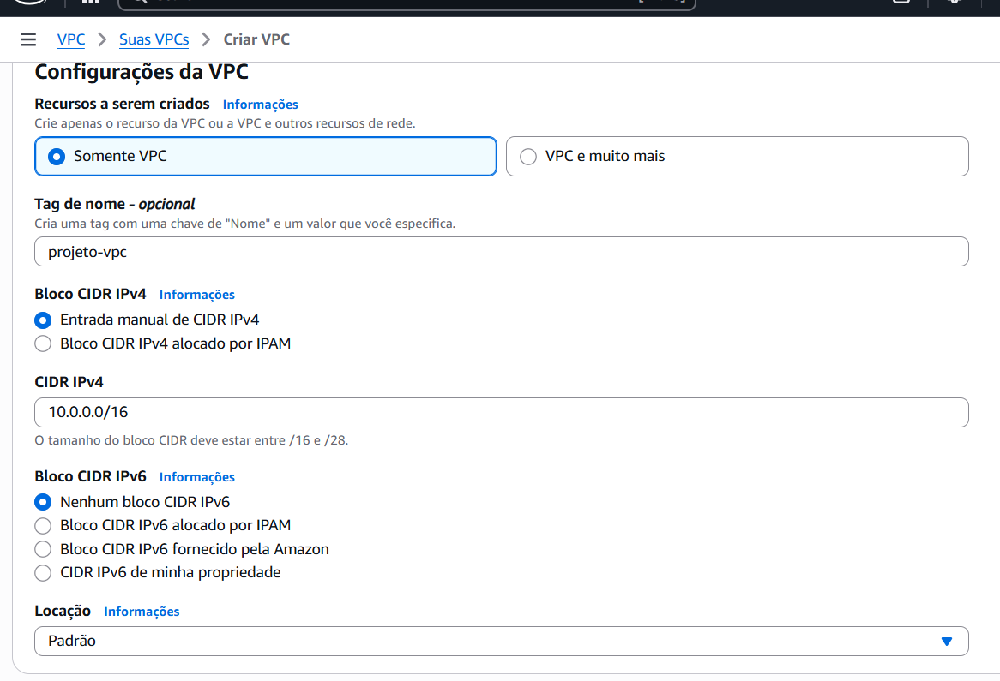

# Documentação do Projeto-Linux
 > No projeto a seguir, será detalhado os passos de como criar uma VPC,com monitoramento automatizado.

### Índice
1.Configuração da VPC e criação do ambiente
2.Monitoramento do scritp via Discord
3.Teste e avaliação do programa

### 1.Configuração da VPC e criação do ambiente

*Criação da VPC pelo console

